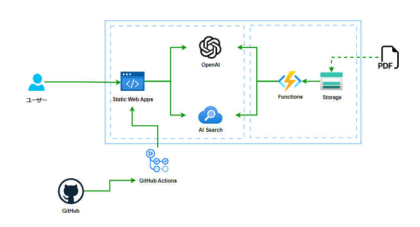

# ReAct アプリケーション

## 全体アーキテクチャ



1. 人からの質問
2. OpenAI へ質問を投げかける。(この時 OpenAI へ送るプロンプトにツールとして AI Search が使えることを含める)
3. OpenAI だけでの解答が難しい場合は、AI Search を使って検索を行い、情報を得る
4. AI Search から得た情報も含めて再度 OpenAI へ情報を送り、回答の要約を作成する
5. 人へ回答を返す

## 検証方法

1. 本 GitHub のリポジトリをご自身の GitHub アカウントに Fork します。
2. 以下のボタンより、Azure へリソースを Deploy します。

[](https://portal.azure.com/#create/Microsoft.Template/uri/https%3A%2F%2Fraw.githubusercontent.com%2Fapc-y-satake%2Fpoc-openai-search-webapp%2Fmain%2Farm%2Ftemplate.json)

3 つのリソースが作成されます。

- Azure OpenAI Service
- Azure AI Search
- Azure Static Web Apps

2. 環境変数ファイルの作成及び、Static Web Apps に環境変数を設定
   root 階層に .env.local ファイルを作成し、以下の内容を記載します。

```:md
AZURE_OPENAI_API_KEY=xxxxxxxxxxxxxxxxxxxxxxxxxxxxxxxx
AZURE_OPENAI_API_INSTANCE_NAME=xxxxxxxxxxxxxxxxxxxxxxxxxxxxxxxx
AZURE_OPENAI_API_DEPLOYMENT_NAME=gpt-35-turbo
AZURE_OPENAI_API_VERSION=2023-09-01-preview
AZURE_OPENAI_API_ENDPOINT=https://xxxxxxxxxxxxxxxxxxxxxxxxxxxxxxxx
AZURE_COGSRCH_SERVICE_NAME=xxxxxxxxxxxxxxxxxxxxxxxxxxxxxxxx
AZURE_COGSRCH_ADMIN_KEY=xxxxxxxxxxxxxxxxxxxxxxxxxxxxxxxx
AZURE_COGSRCH_API_VERSION=2021-04-01
AZURE_COGSRCH_INDEX_NAME=xxxxxxxxxxxxxxxxxxxxxxxxxxxxxxxx
```

設定文字列は以下の箇所を参照してください。
AZURE_OPENAI_API_KEY: Azure OpenAI Service の API キー
AZURE_OPENAI_API_INSTANCE_NAME: Azure OpenAI Service の リソース名
AZURE_OPENAI_API_DEPLOYMENT_NAME: Azure OpenAI Studio の デプロイメント名
AZURE_OPENAI_API_VERSION: 2023-08-01-preview で ok
AZURE_OPENAI_API_ENDPOINT: Azure OpenAI Service の エンドポイント
AZURE_COGSRCH_SERVICE_NAME: Azure AI Search の リソース名
AZURE_COGSRCH_ADMIN_KEY: Azure AI Search の 管理キー
AZURE_COGSRCH_API_VERSION: 2021-04-01 で ok
AZURE_COGSRCH_INDEX_NAME: Azure AI Search の インデックス名

3. Azure Static Web Apps へデプロイ
   Azure へ移動し、Azure Static Web Apps のデプロイ設定へ github の URL を指定し、CI/CD を有効にします。

4. 動作確認
   自動デプロイが完了した後、Azure Static Web Apps の URL へアクセスします。
